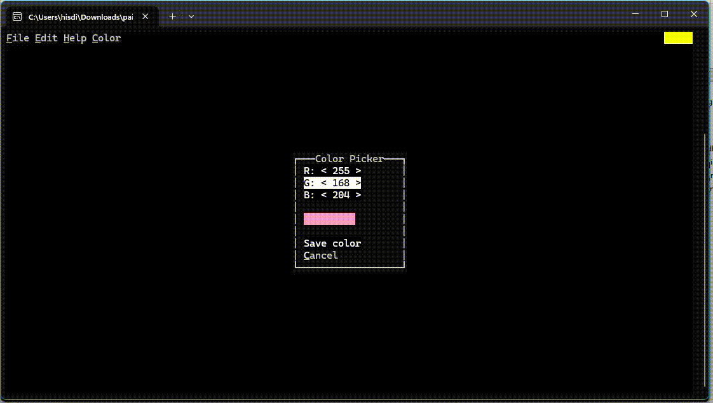

# PAINT IN POWERSHELL

<h2>
  Features:
</h2>
<ul>
  <li>Saving and loading projects (those save console width and height)</li>
  <li>The same but with images</li>
  <li>A trick with ▀ to get square pixels</li>
</ul>

Arrow keys to move 
Enter to draw
